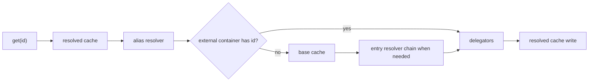

# Componenta DI

PSR-11 dependency injection container for PHP 8.4+. The package provides cached service resolution, reflection autowiring, callable invocation, property and parameter resolvers, attribute-driven configuration, PSR-7 request mapping, lazy objects, virtual proxies, delegators, aliases, external container delegation, and optional compiled DI plans.

**[English](README.md)** | **[Russian](README.ru.md)**

## Installation

```bash
composer require componenta/di
```

## Dependencies

The package requires PHP 8.4+.

| Package | Used for |
|---|---|
| `psr/container` | PSR-11 container contracts. |
| `psr/http-message` | PSR-7 request interfaces used by request attributes. |
| `componenta/array` | Internal array helpers used by request mapping and resolver configuration. |
| `componenta/caster` | `#[Cast]` and request attribute casting. |
| `componenta/config` | Configuration, environment values, `ConfigPath`, and `DefaultValue`. |
| `componenta/priority-list` | Priority-ordered parameter and property resolver chains. |
| `componenta/reflection` | Reflection helpers for constructors, methods, properties, and type names. |
| `componenta/validation` | Optional validation for DTOs created from request mapping. |
| `componenta/var-export` | Exporting normalized configuration and cache payloads. |

## What The Package Owns

`componenta/di` owns runtime dependency resolution. It does not scan your project and it does not decide which providers your application should load. Application-level discovery, config compilation, and entry point bootstrapping belong to `componenta/app` and framework integration packages.

Use this package when you need:

- a PSR-11 container with explicit factories and aliases;
- reflection autowiring for classes and constructor parameters;
- a `make()` path for fresh instances;
- `call()` for invoking callables with DI-resolved parameters;
- property injection through attributes;
- DTO creation from PSR-7 requests;
- lazy PHP 8.4 objects and virtual proxies;
- compiled parameter/property plans for faster production resolution.

## Related Packages

| Package | Why it matters here |
|---|---|
| `componenta/config` | Supplies the `dependencies` section, environment values, and `#[Config]` source data. |
| `componenta/caster` | Used by `#[Cast]` and request attributes with the `cast` option. |
| `componenta/validation` | Can validate DTOs created from HTTP request mapping. |
| `componenta/app-http` | Provides the HTTP application layer that usually passes PSR-7 requests into DI calls through `RequestParameter::with()`. |
| `componenta/app` | Creates the application container and decides whether compiled dependency plans are loaded. |

## Quick Start

```php
use App\Logging\FileLogger;
use App\Logging\LoggerInterface;
use App\Service\UserService;
use Componenta\DI\ContainerBuilder;

$container = (new ContainerBuilder())
    ->addService(LoggerInterface::class, new FileLogger('/var/log/app.log'))
    ->addAlias('logger', LoggerInterface::class)
    ->build();

$logger = $container->get('logger');
$service = $container->make(UserService::class, ['userId' => 7]);
```

`get()` returns a cached service entry. `make()` creates a fresh object and bypasses the resolved-entry cache, delegators, and external containers. Both paths still resolve aliases.

Reflection autowiring is the fallback entry resolver. It can build any requested instantiable class when no factory, invokable, service, alias, delegator, or external container entry handles the id.

## Which Type To Inject

Do not pass the full container everywhere. Choose the interface by the action the class actually performs:

| Contract | Methods | Use when |
|---|---|---|
| `Psr\Container\ContainerInterface` | `get()`, `has()` | A service only needs shared service lookup. |
| `Componenta\DI\FactoryInterface` | `make()` | A service must create a fresh object with resolved dependencies. |
| `Componenta\DI\CallableInvokerInterface` | `call()` | A runner/controller/middleware must invoke a callable through DI. |
| `Componenta\DI\CallableResolverInterface` | `resolve()` | A service must normalize callable definitions. |
| `Componenta\DI\CallableExecutorInterface` | `resolve()`, `call()` | A service needs both callable normalization and invocation. |
| `Componenta\DI\LazyObjectFactoryInterface` | `makeLazy()` | A service only needs native PHP 8.4 lazy objects. |
| `Componenta\DI\VirtualProxyFactoryInterface` | `makeProxy()` | A service only needs native PHP 8.4 virtual proxies. |
| `Componenta\DI\ProxyFactoryInterface` | `makeLazy()`, `makeProxy()` | A service needs to choose between lazy objects and virtual proxies. |
| `Componenta\DI\AliasResolverInterface` | `resolve()`, `set()`, `has()` | Internal wiring and low-level alias management. |

The concrete `Container` also exposes mutation methods: `set()`, `alias()`, `delegator()`, and `addContainer()`. Use them in bootstrap/adapters that intentionally configure the container. Normal services should receive `ContainerInterface`, `FactoryInterface`, or `CallableInvokerInterface` instead of the concrete container.

## Resolution Model

`Container::get($id)` resolves in this order:

1. Return a previously resolved decorated entry by requested id.
2. Resolve aliases to a canonical id.
3. Ask registered external PSR-11 containers.
4. Return a cached base entry or resolve the base entry through the entry resolver chain.
5. Apply delegators registered for the requested id.
6. Cache the decorated result by requested id and canonical id.



`has($id)` only collapses container-level failures to `false`. Real programming errors inside resolvers are allowed to surface.

`Container::make($entry, $params)` resolves a fresh object:

- aliases are resolved;
- explicit `$params` are forwarded to constructor/callable parameter resolution;
- the resolved-entry cache is skipped;
- external containers are skipped;
- delegators are skipped;
- non-object results fail with `ResolutionException`.

## ContainerBuilder API

Use `ContainerBuilder` to configure the container before calling `build()`.

```php
use Componenta\DI\ContainerBuilder;

$builder = new ContainerBuilder();

$builder
    ->addFactory(MailerInterface::class, static fn ($c) => new SmtpMailer(
        $c->get(SmtpConfig::class),
    ))
    ->addInvokable(HealthCheck::class)
    ->addAlias('mailer', MailerInterface::class)
    ->addDelegator(LoggerInterface::class, static fn ($logger) => new MaskingLogger($logger))
    ->addService('app.name', 'Ophire');

$container = $builder->build();
```

| Method | Meaning |
|---|---|
| `addFactory(string $id, callable $factory)` | Registers a factory for an entry id. The callable receives the container. |
| `addFactories(array $factories)` | Bulk factory registration. |
| `addInvokable(string $classOrAlias, ?string $class = null)` | Registers a class that can be constructed without constructor parameters or with default parameters. Keyed form also registers an alias. |
| `addInvokables(array $invokables)` | Bulk invokable registration. |
| `addAutowire(string $class)` | Adds a class to the exported autowire list returned by `toArray()`. It is not a runtime switch: reflection autowiring is already available for any instantiable class. |
| `addAutowires(array $classes)` | Bulk autowire-list registration. |
| `addAlias(string $alias, string $target)` | Resolves `$alias` to `$target`. |
| `addAliases(array $aliases)` | Bulk alias registration. |
| `addDelegator(string $id, callable|string|array $delegator)` | Registers a decorator around an entry. Multiple delegators run in registration order. |
| `addDelegators(array $delegators)` | Bulk delegator registration. |
| `addService(string $id, mixed $service)` | Stores a pre-built shared value. |
| `addServices(array $services)` | Bulk service registration. |
| `compilePlans(iterable $classes, string $mode = PlanCompiler::MODE_SPARSE)` | Builds offline DI plans for known classes. |
| `toArray()` | Exports normalized dependency config. |

Factories are invoked with `Componenta\Config\ContainerValue`. The object implements `Psr\Container\ContainerInterface`, so factories typed as `ContainerInterface` continue to work. When a factory needs application config, typed lookup, or optional fallbacks, type the argument as `ContainerValue`.

```php
use App\Mail\MailerInterface;
use App\Mail\SmtpMailer;
use Componenta\Config\ConfigPath;
use Componenta\Config\ContainerValue;
use Psr\Log\LoggerInterface;

use function Componenta\Config\entry;

$builder->addFactory(
    MailerInterface::class,
    static fn (ContainerValue $container): MailerInterface => new SmtpMailer(
        logger: $container->find('mail.logger', entry(LoggerInterface::class, LoggerInterface::class)),
        host: $container->config->string(new ConfigPath('mail.host'), 'localhost'),
    ),
);
```

`ContainerValue::get($id, Type::class)` asserts the resolved service type. `ContainerValue::find($id, $default)` returns the container entry when present, or resolves an explicit default: `entry(...)` from the container, `config_entry(...)` from `Config`, or `lazy(...)` with the current `ContainerValue`. A plain callable default is not executed and is returned as a value.

## Config-Based Registration

`Container::create()` and `ContainerBuilder::configure()` read the dependency section from `Componenta\Config\Config`.

```php
use Componenta\Config\Config;
use Componenta\DI\ConfigKey;
use Componenta\DI\Container;

$config = new Config([
    ConfigKey::DEPENDENCIES => [
        ConfigKey::FACTORIES => [
            MailerInterface::class => static fn ($c) => new SmtpMailer(),
        ],
        ConfigKey::ALIASES => [
            'mailer' => MailerInterface::class,
        ],
    ],
]);

$container = Container::create($config);
```

Supported keys under `ConfigKey::DEPENDENCIES`:

| Key | Shape | Effect |
|---|---|---|
| `ConfigKey::FACTORIES` | `array<string, callable|class-string|array|FactoryDefinition|ClassDefinition>` | Factory entries resolved by `FactoryResolver`. |
| `ConfigKey::INVOKABLES` | `list<class-string>` or `array<string, class-string>` | Simple class entries. Keyed entries also create aliases unless an explicit alias already exists. |
| `ConfigKey::AUTOWIRES` | `list<class-string>` | Class list preserved in normalized dependency config and cache payloads. It does not limit runtime reflection autowiring. |
| `ConfigKey::ALIASES` | `array<string, string>` | Alias to canonical id map. |
| `ConfigKey::DELEGATORS` | `array<string, callable|string|array|list<...>>` | Decorators applied after base entry resolution. |
| `ConfigKey::SERVICES` | `array<string, mixed>` | Pre-instantiated shared values. |
| `ConfigKey::PARAMETER_RESOLVERS` | `array<int, class-string|callable|ParameterResolverInterface>` | Custom parameter resolvers by priority. |
| `ConfigKey::PROPERTY_RESOLVERS` | `array<int, class-string|callable|PropertyResolverInterface>` | Custom property resolvers by priority. |
| `ConfigKey::PARAMETER_RESOLVERS_REPLACE` | `bool` | When true, default parameter resolvers are not installed. |
| `ConfigKey::PROPERTY_RESOLVERS_REPLACE` | `bool` | When true, default property resolvers are not installed. |
| `ConfigKey::DI_PLANS_MODE` | `'sparse'` or `'complete'` | Compile mode used by application-level DI plan tooling. The runtime container does not compile plans by itself. |

`ConfigKey::DELEGATORS` treats an array value as a list of delegators. If a delegator is itself a callable array, wrap it in an outer list:

```php
ConfigKey::DELEGATORS => [
    \App\Logging\LoggerInterface::class => [[\App\Logging\LoggerDelegator::class, 'decorate']],
],
```

Compiled plan payloads use additional keys from `Componenta\DI\Compile\PlanCompiler` and `Componenta\DI\Compile\PlanDispatcher`:

| Key | Meaning |
|---|---|
| `PlanCompiler::CONFIG_KEY` (`di_plans`) | Parameter and property plans embedded directly in dependency config. |
| `PlanCompiler::FILE_CONFIG_KEY` (`di_plans_file`) | File path to a PHP file returning compiled DI plans. |
| `PlanDispatcher::CONFIG_KEY` (`di_plan_dispatcher`) | `kind => resolver class` map used to route compiled plan entries to matching resolvers. |

`ContainerBuilder::configureWithDependencies($config, $dependencies)` lets production bootstrap pass a preloaded dependency cache while still registering the full `Config` and `Environment` services.

`ContainerBuilder::configureFromCache($config, $cache, $baseDir)` restores dependencies and compiled plan metadata from generated cache files. Relative plan file paths are resolved against `$baseDir`.

## Definitions

Definitions are small immutable objects that describe how an entry should be built. They are useful when plain arrays are not expressive enough or when a generated config file needs a stable value object instead of an ad-hoc shape.

`FactoryDefinition` and `ClassDefinition` can be placed under `ConfigKey::FACTORIES`. `FactoryDefinition`, `ClassDefinition`, and `InvokableDefinition` can also be registered after build with `Container::set($id, $definition)`. `ReferenceDefinition` is only used inside `ClassDefinition` constructor or method parameters.

```php
use App\Clock\ClockInterface;
use App\Logging\FileLogger;
use App\Logging\LoggerInterface;
use App\Service\ReportService;
use Componenta\DI\ConfigKey;
use Componenta\DI\Definition\Definition;

return [
    ConfigKey::DEPENDENCIES => [
        ConfigKey::FACTORIES => [
            LoggerInterface::class => Definition::factory(
                static fn ($container): LoggerInterface => new FileLogger('/var/log/app.log'),
            ),

            ReportService::class => Definition::autowire(ReportService::class)
                ->constructor([
                    'logger' => Definition::reference(LoggerInterface::class),
                ])
                ->method('setClock', [
                    Definition::reference(ClockInterface::class),
                ]),
        ],
    ],
];
```

| Definition | Meaning |
|---|---|
| `Definition::factory(callable $factory)` | Wraps a callable factory. The callable receives the container and returns the entry value. |
| `Definition::autowire(string $className)` | Creates a `ClassDefinition` for explicit `new $className(...$params)` construction inside `FactoryResolver`. |
| `Definition::reference(string $entryId)` | Refers to another container entry inside `ClassDefinition` constructor or method parameters. |
| `Definition::invokable(string $className)` | Creates an `InvokableDefinition` for entries that should be created through `InvokableResolver`. |
| `ClassDefinition::constructor(array $params)` | Returns a new class definition with constructor parameters. String keys are named arguments; integer keys are positional arguments. |
| `ClassDefinition::method(string $method, array $params = [])` | Returns a new class definition with a post-construction method call. Repeating the same method name replaces its parameter list. |

`ClassDefinition` is immutable: every builder-style method returns a new instance. Store the returned value when composing a definition in multiple steps.

Despite the method name, `Definition::autowire()` does not run constructor autowiring for missing arguments. Every constructor and method value must be supplied explicitly; use `Definition::reference()` when the value should come from the container.

`ClassDefinition` is resolved by `FactoryResolver`, not by the full reflection pipeline. It calls the constructor with the configured parameters and then runs configured method calls. It does not run `#[Inject]` or `#[SetUp]`, and it does not read class-level `#[Lazy]` or `#[Proxy]`. Those behaviors belong to other entry resolvers: `ReflectionResolver` handles constructor DI, property injection, and setup; `InvokableResolver` only honors class-level lazy/proxy attributes for no-argument entries.

## ConfigProvider

`Componenta\DI\ConfigProvider` registers optional DI integrations:

- `#[Cast]` support through `componenta/caster`;
- `#[CurrentUser]` support through `CurrentUserProviderInterface`;
- PSR-7 scalar request extractors;
- PSR-7 request-to-DTO mappers;
- no-op `CurrentUserProviderInterface` for applications without authentication integration.

Typical framework config:

```php
return [
    new \Componenta\Caster\ConfigProvider(),
    new \Componenta\Validation\ConfigProvider(),
    new \Componenta\DI\ConfigProvider(),
];
```

The base builder already installs the core resolver chain. The provider adds optional resolvers whose dependencies live in other packages.

## Attributes

Attributes are metadata only. Parameter and property resolver chains implement the behavior. This keeps attribute objects cheap to instantiate and easy to inspect.

### Core Injection Attributes

| Attribute | Target | Constructor | Behavior |
|---|---|---|---|
| `#[Inject]` | property | none | Resolves the property type from the container and writes it after object construction. |
| `#[EntryId]` | parameter, property | `string $value` | Resolves a specific container entry instead of using the type/name. |
| `#[Make]` | parameter, property | `?string $entry = null, array $params = []` | Creates a fresh object through `FactoryInterface::make()`. When entry is null, the resolver uses the target type or target name. |
| `#[Config]` | parameter, property | `string|ConfigPath|null $path = null, mixed $default = DefaultValue::None` | Reads from the root config service. `null` uses the parameter/property name. `string` is a literal key. `ConfigPath` enables dot traversal. |
| `#[Env]` | parameter, property | `?string $name = null, mixed $default = DefaultValue::None` | Reads from `Environment`. Null name uses the target name converted to `UPPER_SNAKE_CASE`; scalar values are coerced through the target type. |
| `#[Cast]` | parameter, property | `string $name, mixed $default = DefaultValue::None` | Reads a provided parameter/property-context value by target name and casts it through `CasterProviderInterface`. If no value is supplied, the attribute default is used when present; parameters can also fall back to `null` or their PHP default. |
| `#[CurrentUser]` | parameter, property | `?class-string $type = null` | Resolves the authenticated user from `CurrentUserProviderInterface`; nullable targets can receive null. |
| `#[Init]` | property | `mixed $callable, array $params = []` | Computes a property value by invoking a callable during property injection. |

```php
use App\Logging\LoggerInterface;
use App\Mail\MailerInterface;
use Componenta\Config\ConfigPath;
use Componenta\DI\Attribute\Config;
use Componenta\DI\Attribute\EntryId;
use Componenta\DI\Attribute\Env;
use Componenta\DI\Attribute\Inject;

final class ReportService
{
    #[Inject]
    private LoggerInterface $logger;

    public function __construct(
        #[EntryId('mailer.transactional')]
        private MailerInterface $mailer,

        #[Config(new ConfigPath('reports.limit'), default: 100)]
        private int $limit,

        #[Env('REPORTS_QUEUE', default: 'default')]
        private string $queue,
    ) {}
}
```

Property injection writes only properties with an explicit value from context or an attribute resolver. It skips static properties, constructor-promoted properties, and readonly properties that are already initialized.

### Lifecycle And Construction Attributes

| Attribute | Target | Behavior |
|---|---|---|
| `#[SetUp('method', params: [...])]` | class, repeatable | Calls a method after construction and property injection. Method parameters are resolved through the parameter chain. |
| `#[NoConstructor]` | class | Instantiates with `ReflectionClass::newInstanceWithoutConstructor()`. The constructor is skipped; property injection and `#[SetUp]` still run afterward when configured. |
| `#[Lazy]` | class | Uses PHP 8.4 `newLazyGhost()` when the class is resolved by `ReflectionResolver` or `InvokableResolver`. Preserves class identity. |
| `#[Proxy]` | class, parameter, property | Uses PHP 8.4 `newLazyProxy()`. On classes it is handled by `ReflectionResolver`/`InvokableResolver`; on parameters and properties it wraps `FactoryInterface::make()` through `MakeAttributeResolver`. |

Explicit `#[SetUp('method', params: [...])]` parameters are unwrapped before the method is called. The runner supports legacy DI metadata objects `EntryId`, `Config`, and `Env`, plus value objects from `componenta/config`: `ContainerEntry`, `ConfigEntry`, and `LazyValue`. `ContainerEntry` fetches a service from the container, `ConfigEntry` reads from `Config`, and `LazyValue` executes with the current `ContainerValue`. Use `LazyValue` in programmatic setup configuration; a closure cannot be passed directly as a PHP attribute argument.

```php
use App\Logging\LoggerInterface;
use App\Search\Client;
use Componenta\Config\ConfigEntry;
use Componenta\Config\ConfigPath;
use Componenta\Config\ContainerEntry;
use Componenta\DI\Attribute\Lazy;
use Componenta\DI\Attribute\SetUp;

#[Lazy]
#[SetUp('boot', params: [
    'logger' => new ContainerEntry(LoggerInterface::class, LoggerInterface::class),
    'name' => new ConfigEntry(new ConfigPath('app.name')),
])]
final class SearchIndex
{
    public function __construct(private Client $client) {}

    public function boot(LoggerInterface $logger, string $name): void
    {
        $logger->info($name . ' search index initialized');
    }
}
```

`#[Lazy]` preserves `get_class($service) === SearchIndex::class`. `#[Proxy]` keeps type compatibility but `get_class()` reports the generated proxy class.

### Request Scalar Attributes

These attributes target callable/controller parameters and require a PSR-7 `ServerRequestInterface` to be supplied through the DI request parameter context.

Use `RequestParameter::with()` when invoking a callable or creating an object that depends on request attributes:

```php
use Componenta\DI\Resolver\Parameter\Request\RequestParameter;

$response = $container->call(
    [$controller, 'show'],
    RequestParameter::with(['id' => '7b828e6e-2a7b-4f3a-9c27-3f8057c3f5c4'], $request),
);
```

| Attribute | Constructor | Source | Missing value behavior |
|---|---|---|---|
| `#[Header]` | `string $name, mixed $default = DefaultValue::None, ?string $cast = null` | `$request->getHeaderLine()` | Throws `RuntimeException` unless default is provided. |
| `#[Cookie]` | `string $name, mixed $default = DefaultValue::None, ?string $cast = null` | `$request->getCookieParams()` | Throws `RuntimeException` unless default is provided. |
| `#[QueryParam]` | `?string $name = null, mixed $default = DefaultValue::None, ?string $cast = null` | `$request->getQueryParams()` | Throws `RuntimeException` unless default is provided. Null name uses parameter name. |
| `#[PayloadParam]` | `string|ConfigPath|null $name = null, mixed $default = DefaultValue::None, ?string $cast = null` | parsed body | Throws `RuntimeException` unless default is provided. `ConfigPath` supports nested lookup. |
| `#[RequestAttribute]` | `?string $name = null, mixed $default = DefaultValue::None, ?string $cast = null` | `$request->getAttributes()` | Throws `RuntimeException` unless default is provided. Null name uses parameter name. |
| `#[ServerParam]` | `string $name, mixed $default = DefaultValue::None, ?string $cast = null` | `$request->getServerParams()` | Throws `RuntimeException` unless default is provided. |
| `#[UploadedFile]` | `string $name` | `$request->getUploadedFiles()` | Returns file, nested file array, or null. Dot notation is supported. |

```php
use Componenta\DI\Attribute\PayloadParam;
use Componenta\DI\Attribute\QueryParam;
use Psr\Http\Message\ResponseInterface;

final readonly class Controller
{
    public function __invoke(
        #[QueryParam(cast: 'int', default: 1)]
        int $page,

        #[PayloadParam('title')]
        string $title,
    ): ResponseInterface {
        // ...
    }
}
```

### Request Mapping Attributes

Request mapping attributes extract request data, transform it, and return either an array or a DTO. If the target parameter type is `array`, the resolver returns the transformed array. If the target parameter type is a class, the resolver validates the raw data when a validator exists for that class and then creates the DTO through `FactoryInterface::make()`.

| Attribute | Extracts |
|---|---|
| `#[MapHeaders]` | Request headers. |
| `#[MapCookies]` | Cookie params. |
| `#[MapQueryString]` | Query params. |
| `#[MapRequestPayload]` | Parsed body array or object vars. |
| `#[MapRequestAttributes]` | Request attributes. |
| `#[MapServerParams]` | Server params. |
| `#[MapUploadedFiles]` | Uploaded files. |

All mapping attributes extend `RequestMapper`. A custom mapper can configure:

| Property | Type | Meaning |
|---|---|---|
| `$attributes` | `list<string>` | Extra request attributes to merge into raw data. `['*']` means all attributes. |
| `$files` | `list<string>` | Extra uploaded files to merge into raw data. `['*']` means all files. |
| `$map` | `array<string, string>` | Source field to target field mapping. Prefix a source with `?` to mark it optional. |
| `$cast` | `array<string, string>` | Field caster names applied after mapping. |
| `$defaults` | `array<string, mixed>` | Final default values for missing keys. |
| `$sortMap` | `array<string, array>` | Converts `sort` aliases to `orderBy`. Removes raw `sort` and `order`. |
| `$exclude` | `list<string>` | Removes fields from final data. |

When `$map` is declared as an overriding property, keep `protected(set) array $map` because the base `RequestMapper` property uses the same setter visibility.

```php
use App\Post\CreatePostCommand;
use Componenta\DI\Attribute\MapRequestPayload;
use Psr\Http\Message\ResponseInterface;

final class MapCreatePostCommand extends MapRequestPayload
{
    protected array $attributes = ['actor'];

    protected(set) array $map = [
        'post_title' => 'title',
        '?summary' => 'summary',
    ];

    protected array $cast = [
        'published' => 'bool',
    ];

    protected array $defaults = [
        'published' => false,
    ];
}

final readonly class CreatePostController
{
    public function __invoke(
        #[MapCreatePostCommand]
        CreatePostCommand $command,
    ): ResponseInterface {
        // ...
    }
}
```

The pipeline order is:

1. extract raw data from the request;
2. validate raw data when a validator exists for the DTO type;
3. map source keys to target keys;
4. cast mapped fields;
5. apply defaults;
6. apply sort aliases;
7. remove excluded keys;
8. return the transformed array for `array` parameters, or construct the DTO through `FactoryInterface::make()` for class-typed parameters.

## Callable Invocation

`CallableInvokerInterface::call()` invokes a callable after resolving missing parameters through DI.

```php
$result = $container->call(
    [$controller, 'show'],
    ['id' => '7b828e6e-2a7b-4f3a-9c27-3f8057c3f5c4'],
);
```

Explicit `$params` win over DI resolution by parameter name or position. The callable's own exceptions propagate unchanged.

`CallableResolverInterface::resolve()` accepts:

- closures;
- global function names;
- `"Class::method"` strings;
- service id strings that resolve to invokable objects;
- `[object, 'method']`;
- `[class-string, 'method']`.

## Custom Resolvers

Parameter resolvers implement `ParameterResolverInterface`. Returning `[position, value]` means the resolver found a value for the current parameter. Returning `null` lets the next resolver try.

```php
use Componenta\DI\Resolver\Parameter\ParameterResolverInterface;
use ReflectionNamedType;
use ReflectionParameter;

final class TenantResolver implements ParameterResolverInterface
{
    public function __construct(
        private TenantContext $tenant,
    ) {}

    public function resolveParameter(
        ReflectionParameter $parameter,
        array $providedParameters = [],
        array $resolvedParameters = [],
    ): ?array {
        $type = $parameter->getType();

        if (!$type instanceof ReflectionNamedType || $type->getName() !== Tenant::class) {
            return null;
        }

        return [$parameter->getPosition(), $this->tenant->current()];
    }
}
```

Property resolvers implement `PropertyResolverInterface` and return `[ReflectionProperty $property, mixed $value]` or `null`.

```php
use Componenta\DI\ConfigKey;

return [
    ConfigKey::DEPENDENCIES => [
        ConfigKey::PARAMETER_RESOLVERS => [
            950 => TenantResolver::class,
        ],
    ],
];
```

Resolver priority is descending. Higher values run earlier. Default priorities are exposed as `ContainerBuilder::PRIORITY_PARAM_*` and `ContainerBuilder::PRIORITY_PROP_*` constants so custom resolvers can be inserted between defaults.

Use `PARAMETER_RESOLVERS_REPLACE` or `PROPERTY_RESOLVERS_REPLACE` only when you intentionally want to remove the default chain.

## Lazy Objects And Virtual Proxies

```php
$lazy = $container->makeLazy(Service::class, static fn () => new Service());
$proxy = $container->makeProxy(Service::class, static fn () => new Service());
```

Use class-level `#[Lazy]` for reflection or invokable services when preserving exact class identity matters. Use class-level `#[Proxy]` for reflection or invokable services that should be represented by a virtual proxy.

Use parameter/property `#[Proxy]` when the injection point should receive a virtual proxy created through `FactoryInterface::make()`. Combine it with `#[Make(ConcreteService::class)]` when the declared type is an interface and the concrete entry is different from the type name.

Class-level `#[Lazy]` and `#[Proxy]` are read by `ReflectionResolver` and `InvokableResolver`. They are not read for objects returned by ordinary factories. Factory-bound entries are eager by default.

Factories can implement `LazyServiceFactoryInterface` when they need to control lazy construction for a factory-bound entry. The `lazy(ContainerInterface $container, ProxyFactoryInterface $proxyFactory)` method decides whether to return a PHP 8.4 lazy object or a virtual proxy.

## Delegators

Delegators decorate a resolved entry.

```php
$builder->addDelegator(
    LoggerInterface::class,
    static fn (LoggerInterface $logger, ContainerInterface $container): LoggerInterface =>
        new MaskingLogger($logger),
);
```

Multiple delegators run in registration order. Delegator definitions may be closures, function names, `"Class::method"` strings, invokable service ids, or `[class-string|object, method]` arrays. `make()` intentionally skips delegators.

In config files, an array under `ConfigKey::DELEGATORS[$id]` is interpreted as the full delegator list. Wrap callable-array delegators in an outer array so the builder registers them as one delegator.

## External Containers

`Container::addContainer()` registers another PSR-11 container as a lookup source. External containers are checked before the local resolver chain and after alias resolution.

Use this to bridge vendor containers or application containers. Do not use it as a replacement for explicit aliases when the local container owns the service contract.

## Compiled DI Plans

Runtime reflection can be avoided for known classes by compiling parameter and property plans ahead of time.

```php
use Componenta\DI\Compile\PlanCompiler;

$plans = $builder->compilePlans(
    [CreatePostCommand::class, UpdatePostCommand::class],
    PlanCompiler::MODE_SPARSE,
);
```

Plan support is optional:

- if no plan exists for a class or attribute combination, resolution falls back to the normal resolver chain;
- sparse plans only store targets that need non-trivial resolution;
- complete plans are useful for rollback/debugging but produce larger cache payloads;
- plan files can be restored through `configureFromCache()`.

Resolvers that participate in offline planning implement `AttributeMatcherInterface` plus parameter/property plan interfaces.

## Exceptions

| Exception | When it is thrown |
|---|---|
| `NotFoundException` | No resolver can provide the requested entry. |
| `CircularDependencyException` | A dependency cycle is detected while resolving entries. |
| `ResolutionException` | A resolver fails or `make()` produces a non-object. |
| `InvalidConfigurationException` | A definition, resolver, cache payload, or dependency config is malformed. |
| `InvalidCallableException` | A callable definition cannot be normalized. |
| `DelegatorException` | A delegator fails while decorating an entry. |

All package exceptions implement `Componenta\DI\Exception\ExceptionInterface`; callable-specific failures also implement `CallableExceptionInterface` where applicable.

## Production Usage

Recommended production shape:

1. Build framework config once through application bootstrap tooling.
2. Compile provider output and DI plans into cache files.
3. Load dependency cache in the entry point.
4. Use `ContainerBuilder::configureWithDependencies()` or `configureFromCache()`.
5. Keep runtime discovery disabled.

This keeps provider instantiation, class scanning, and reflection-heavy plan building out of the hot path.
